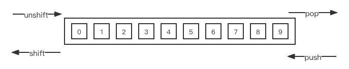

# 数组操作总结

## 静态方法

1.创建
    - Array.from() 
        - 方法对一个类似数组或可迭代对象创建一个新的，浅拷贝的数组实例。
        - @return 
    - Array.of() 
        - 创建一个具有可变数量参数的新数组实例，而不考虑参数的数量或类型。 
        - @return 新的数组实例
    - Array.isArray() 
    

## 实例方法
### 1.栈操作（改变原数组）



- push() 
  - @des 从后插入一条或多条 
  - @return 新数组长度
- pop() 
  - @des 从后面删除一条
  - @return 被删除的元素
- shift() 
  - @des 删除第一个元素 
  - @return 被删除的元素
- unshift() 
  - @des 在数组最前端插入一条或多条
  - @return 新数组长度

### 2.数组排序

- sort()
    - @des 数组排序
    - @param() ((a, b) => { <0 a放在b的前面 | >0 b放在a前面 | =0 相对位置不变})
    - @return 返回排序后的数组
    
> sort中比较函数的返回值，仅决定两个元素是否调换位置

比较规则函数

```js
function compare(a, b) {
  // 若a 小于 b，a会被放在b前面
  if (a < b ) {           
    return -1;
  }
  // 若a > b，a会被放在b的后面
  if (a > b ) {
    return 1;
  }
  // a must be equal to b
  return 0;
}

```

以上函数可以简化如下

```js
// 最简单的数字升序
 function compareNumbers(a, b) {
  return a - b;
}
```
    
### 3.数组迭代

- map()
- reduce()
- reduceRight()
- forEach()
    - @return undefined
    - @Param ((currentValue, index, array): boolean, thisArg)

### 4.数组筛选

- filter()
    - @des 方法创建一个新数组, 其包含通过所提供函数实现的测试的所有元素。
    - @return element[]
    - @param (((element, index, array) => {}, this.arg))
- find()
    - @des 方法返回数组中满足提供的测试函数的第一个元素的值,若没有，返回undefined。
    - @return item | undefined
    - @param ((element, index, array) => {}, this.arg)
- every()
    - des 方法测试一个数组内的所有元素是否都能通过某个指定函数的测试。
    - @params (((element, index, array) => {}, this.arg))
    - @return boolean
- some()
    - des 方法测试数组中是不是至少有1个元素通过了被提供的函数测试。
    - @params (((element, index, array) => {}, this.arg))
    - @return boolean
- includes()
    - @des 方法用来判断一个数组是否包含一个指定的值
    - @params (valueToFind[, fromIndex])
    - @return boolean
```js
const obj = {a: 1};
const arr = [];
arr.push(obj);
arr.includes(obj) // true
arr.includes({a: 1}) // false
```
- indexOf()
    - @des
    - params (searchElement[, fromIndex])
    - @return index | -1
- lastIndexOf()
    - @des 方法返回指定元素在数组中的最后一个的索引，不存在返回-1
    - @params (searchElement[, fromIndex])
    - @return index | -1
    
```js
const arr = [2, 5, 9, 2];
// 第二个参数为2,表示从索引为2的位置向前查找
arr.lastIndexOf(9, 2) // 2
// 第二个参数为1,表示从索引为1的位置向前查找
arr.lastIndexOf(9, 1) // -1
```
- findIndex()
    - @des 方法返回数组中满足提供的测试函数的第一个元素的索引,若没有，返回-1
    - @return index | -1

### 5.数组创建填充

- fill()
    - @des 方法用一个固定值填充一个数组中从起始索引到终止索引内的全部元素
```js
Array(10)
Array(10).fill('')
```
- copyWithin()

### 6. 操作方法
- slice()
    - @des 方法返回一个新的数组对象，这一对象是一个由 begin 和 end 决定的原数组的浅拷贝
    - @param (begin, end) @return [begin, end)
    - @param (begin) @return [begin, Array.length -1]
- splice()
    - @param (start) @return (start, Array.length - 1] @des 删除
    - @param (start, deleteCount) @return [start, start + deleteCount - 1] @des 删除
    - @param (start, deleteCount, [item1, item2...]) @return [start, start + deleteCount - 1] @des 删除后添加
- concat()
- reverse()

### 7.扁平化方法
- flat()
  - @params (depth: 1... Infinity)
- flatMap()


1.
- keys()
    - @des 方法返回一个包含数组中每个索引键的Array Iterator对象。
- values()
    - @des 
- entries()
    - @des 方法返回一个新的Array Iterator对象，该对象包含数组中每个索引的键/值对。
```js
var arr = ["a", "b", "c"];
var iterator = arr.entries();
console.log(iterator); // Array Iterator{}
console.log([...iterator]) // [[0, 'a'], [1, 'b'], [2, 'c']]
```

1. 转换方法
    - toString()
    - valueOf()
    - toLocaleString()
    - join()
        - @param separator
        - @return string
    
