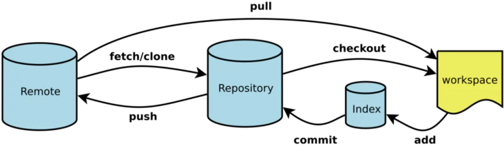

# Git

## 


- Workspace：工作区
- Index / Stage：暂存区
- Repository：仓库区（或本地仓库）
- Remote：远程仓库


git add 把文件添加进去，实际上就是把文件修改添加到暂存区；
git commit 提交更改，实际上就是把暂存区的所有内容提交到当前分支。


- git commit
    - git commit -a
    - git commit -m
- git branch
    - git branch -d <branch> 删除分支
    - git branch -b
    - git branch -r 查看远程分支
    - git branch -a 查看所有分支
    - git branch -u origin/remoteBranch  设置已有的本地分支跟踪一个刚刚拉取下来的远程分支 & 修改正在跟踪的上游分支
    - git branch --set-upstream-to origin/remoteBranch (同上)

- git checkout
    - git checkout -b newBranch
    - git checkout -b localBranch origin/remoteBranch 拉取远程分支并创建本地分支
    - git checkout -b --track origin/remoteBranch 拉取远程分支并创建本地分支(同上)
    - git checkout [<commit>] [--] <filepath>

- git status

- git merge
    - git checkout originalBranch
    - git merge branchWaitingForMerge

- git rebase
    - git checkout toBaseBranch
    - git rebase rebaseTargetBranch 变基操作的目标基底分支
      它的原理是首先找到这两个分支的最近共同祖先，然后对比当前分支相对于该祖先的历次提交，
      提取相应的修改并存为临时文件，然后将当前分支指向目标基底,
      最后以此将之前另存为临时文件的修改依序应用。
- git fetch
    - git fetch origin remoteBranch:localBranch

- git pull
    - git fetch & git merge
- git push
    - git push -d remoteBranch 删除远程分支

- git log
    - 查看之前提交的commit id

- git reset
    - git reset --hard HEAD^ 完全回退到上一个版本
    - git reset --hard <File> 取消暂存

- git reflog
  可以查看所有分支的所有操作记录

- git stash

- git diff

- git rm

如果你想把一个文件从版本控制中移除，并且保留本地的文件，首先需要把这个文件加入到gitignore文件中。
然后执行以下命令就可以了。
```shell
# 删除文件
git rm file_path --cached
# 删除文件夹
git rm -r folder_path --cached
```
如果想把所有gitignore中的文件从版本控制中删除的话，需要执行以下两个命令，即先移除所有文件，再执行添加所有文件（这次会忽略gitignore中的文件）。

```shell
git rm -r . --cached
git add .
```

```shell script
git clone -o <customerRemoteName>  # 
git ls-remote <remote>
```


HEAD


